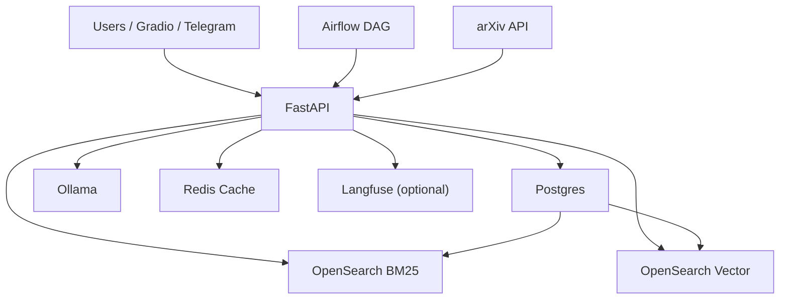

# ArXiv Research Copilot

> Agentic RAG system for arXiv papers with staged ingestion, hybrid retrieval, grounded Q&A, and workflow orchestration.


## What this project is

ArXiv Research Copilot is a backend-first research assistant for working with a focused set of arXiv papers.

It ingests papers from arXiv, parses and chunks them, stores them in Postgres, builds keyword and vector indexes in OpenSearch, and exposes retrieval and Q&A APIs on top of that corpus. The project also includes Airflow-based ingestion orchestration, Redis caching, optional Langfuse tracing, and a lightweight Gradio UI for demos.

This is not a general web assistant. It answers from the paper corpus you ingest.

## Core capabilities

- Staged paper ingestion: `fetch-store`, `parse`, `chunk`, `index`
- Full one-shot ingestion pipeline endpoint
- Postgres as source of truth for papers, chunks, and feedback
- BM25 paper search, BM25 chunk search, and hybrid retrieval
- Vector indexing with optional Jina embeddings
- Grounded Q&A with source chunks
- Streaming answer endpoint over SSE
- Agentic Q&A flow with guardrails, scope checks, retrieval retry, and grading
- Redis-backed answer cache with trace and latency headers
- Airflow DAG for scheduled ingestion orchestration
- Gradio UI for manual testing and demo flow
- Pytest plus Ruff plus GitHub Actions CI

## Typical use case

1. Ingest a bounded paper set from arXiv.
2. Build keyword and vector retrieval layers over that corpus.
3. Ask questions about those papers instead of manually reading each one end to end.
4. Inspect retrieved sources, grounded answers, and agentic decision steps.

## Architecture overview



## Technology stack

### Backend

- Python 3.12
- FastAPI
- SQLAlchemy
- Pydantic v2
- UV

### Data and retrieval

- PostgreSQL
- OpenSearch
- Redis
- Jina embeddings (optional)

### Orchestration and generation

- Airflow 3
- Ollama
- Langfuse (optional)

### Developer tooling

- Docker Compose
- Pytest
- Ruff
- GitHub Actions
- Gradio

## Quick start

### Prerequisites

- Docker and Docker Compose
- `uv`
- macOS or Linux shell

### 1. Setup

```bash
git clone <your-repo-url>
cd arxiv-research-copilot
cp .env.example .env
uv sync
```

Optional:

- Set `JINA_API_KEY` in `.env` for higher-quality vector embeddings
- Set Langfuse keys if you want tracing beyond local logs
- Enable Telegram only if you want bot-based interaction

### 2. Start the stack

```bash
make start
make health
```

Main endpoints:

- API: `http://localhost:8000`
- API docs: `http://localhost:8000/docs`
- Airflow: `http://localhost:8080`
- OpenSearch Dashboards: `http://localhost:5601`

### 3. Run a full ingestion pipeline

```bash
curl -s -X POST "http://localhost:8000/api/v1/papers/ingest/pipeline?max_results=3"
```

What happens:

- latest arXiv papers are fetched
- metadata is upserted into Postgres
- PDFs are parsed when available
- text is chunked
- BM25 and vector indexes are refreshed

### 4. Try retrieval

```bash
curl -s -X POST "http://localhost:8000/api/v1/search" \
  -H "Content-Type: application/json" \
  -d '{"query":"reasoning","size":3}'

curl -s -X POST "http://localhost:8000/api/v1/chunk-search" \
  -H "Content-Type: application/json" \
  -d '{"query":"preference vectors","size":3}'

curl -s -X POST "http://localhost:8000/api/v1/hybrid-search" \
  -H "Content-Type: application/json" \
  -d '{"query":"trustworthy personalized explanations","size":3}'
```

### 5. Try grounded Q&A

```bash
curl -s -X POST "http://localhost:8000/api/v1/ask" \
  -H "Content-Type: application/json" \
  -d '{"question":"What does PONTE optimize for?","top_k":3}'
```

Streaming variant:

```bash
curl -N -X POST "http://localhost:8000/api/v1/ask/stream" \
  -H "Content-Type: application/json" \
  -d '{"question":"What does PONTE optimize for?","top_k":3}'
```

Agentic variant:

```bash
curl -s -X POST "http://localhost:8000/api/v1/agentic-ask" \
  -H "Content-Type: application/json" \
  -d '{"question":"What does PONTE optimize for?","top_k":3}'
```

## API surface

### Ingestion

- `POST /api/v1/papers/ingest/fetch-store`
- `POST /api/v1/papers/ingest/parse`
- `POST /api/v1/papers/ingest/chunk`
- `POST /api/v1/papers/ingest/index`
- `POST /api/v1/papers/ingest/pipeline`

### Retrieval

- `POST /api/v1/search`
- `POST /api/v1/chunk-search`
- `POST /api/v1/hybrid-search`

### Q&A

- `POST /api/v1/ask`
- `POST /api/v1/ask/stream`
- `POST /api/v1/agentic-ask`

### Supporting endpoints

- `GET /health`
- `POST /api/v1/feedback`

## Gradio demo UI

Start it with:

```bash
uv run python gradio_launcher.py
```

Open:

- `http://localhost:7860`

Available tabs:

- Ask
- Ask Stream
- Hybrid Search
- Agentic Ask

## Airflow orchestration

The repo includes an Airflow DAG for staged ingestion orchestration.

To verify it:

1. Open `http://localhost:8080`
2. Find `arxiv_ingestion_dag`
3. Trigger a run
4. Confirm task success in this order:
   - `fetch_and_store_metadata`
   - `parse_full_text`
   - `chunk_papers`
   - `index_search_layers`

## Project structure

```text
arxiv-research-copilot/
├── airflow/                 # Airflow DAGs
├── docs/                    # Public docs
├── scripts/                 # Local utility and indexing scripts
├── src/
│   ├── db/                  # DB setup
│   ├── errors/              # Typed exception model + handlers
│   ├── models/              # SQLAlchemy models
│   ├── routers/             # FastAPI endpoints
│   ├── schemas/             # Pydantic schemas
│   └── services/            # Ingestion, retrieval, LLM, cache, tracing, bots
├── tests/                   # Unit, API, and integration tests
├── docker-compose.yaml
├── gradio_launcher.py
├── Makefile
└── pyproject.toml
```

## Development commands

```bash
make start
make status
make health
make logs
make lint
make test
make stop
make clean
```

## Engineering notes

- Postgres stores source-of-truth records for papers and chunks
- OpenSearch stores serving indexes, not canonical records
- Redis cache misses do not block answer generation
- Vector indexing can be optional or degraded without blocking BM25
- Typed API errors follow a consistent schema
- CI runs Ruff and Pytest on push and pull request

## Public docs

- Architecture: [docs/architecture.md](docs/architecture.md)
- Runbook: [docs/runbook.md](docs/runbook.md)

## Notes

- Keep `.env` local and uncommitted
- `.env.example` is the setup template
- This repo is intentionally backend-heavy; Gradio is included as a thin demo interface
